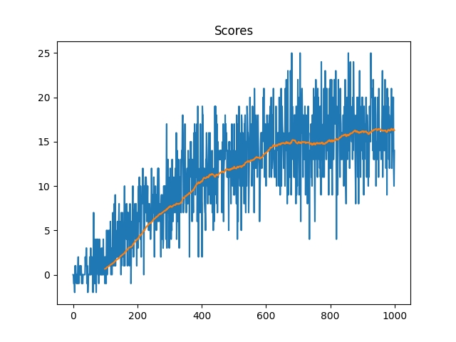

# Code Structure

At the root level we find the markdown files readme and report that will help you to understand how the project works.
The UnityEnv folder contains the windows version of the unity banana env. It wouldn't be necessary in the repo it can be downloaded separately but this way is quicker. Like some "portable" version. Add here the specific version for your S.O if you aren't using Windows.

we can also find some assets for the readme.

The source folder contains all the python files to code the agent and the rest of the required logic.

    - model contains the Torch implementation of the neural network model that is being used in the project.

    - cli.py has a bit of code to provide the command line interface argument "--train" this way we can set dynamic logic based on terminal's input

    - config.py Is basically a wrapper class for the hyperparameters so it doesn't make other files bigger and keeps our code clean.

    - dqn_agent_bananas.py Contains the core of the project, where we use the previously defined torch model to learn from the experiences. The code is quite similar to the dqn exercices of the course but logically adapted for this problem.

    - replay_buffer.py It contains the memory experience replay isolated just to be cleaner.

    - main.py puts togheter all the pieces to build and train the agent. It has two flows according with the CLI modes (train/test)
    
# Learning Algorithm
    
    It uses the DQN algorithm with replay buffer and fixed Q Target as improvements to make the learning process better. It also uses epsilon greedy exploration/exploitation as the way to explore the state space.

   **Highlevel pseudo-code of the algorithm**
    
   Init replay memory

   Init Q values with random weights

   Create a copy of Qvalues as Qtarget

    foreach episode

        Get initial state

        for each step in episode:

            Choose an action using epsilon-greedy policy

            Take action and observe the reward and get next state

            Store the experience tuple in the replay buffer
            
            if we have enough experiences:

                Get a minibatch of tuples

                Calculate target using the maximum Qtarget on the action value equation

                Update the parameters of our action-value neural network Qvalue function aproximator (using gradient descent)

                Every C steps update Qtarget weights using Qvalues and tau for the soft-update
                
   **Hyperparameters**

    BUFFER_SIZE = int(1e5)  # replay buffer size
    BATCH_SIZE = 64         # minibatch size
    GAMMA = 0.99            # discount factor
    TAU = 1e-3              # for soft update of target parameters
    LR = 5e-4               # learning rate 
    UPDATE_EVERY = 4        # how often to update the network
    
    **Neural Network**
    
    The architecture is quite simple, multi-layer perceptron. Input layer matches the state size then we have 2 hidden fully connected layers and finaly the output layer matching the action space. Each hidden layer has 64 neurons and the layers use the relu activation function.

# Plot of Rewards

The environment gets solved in 467 episodes.
# Ideas for Future Work

To improve the agent's performance we could do hyperparameter optimization using some framework like Optuna to make the model converge faster or even collect better experiences for its learning process. We can think about searching for a better value of each of the config.py values or also tune the neural network itself. More layers, More units.

We can also use DQN improvements as DDQN and/or prioritized experienced replay.